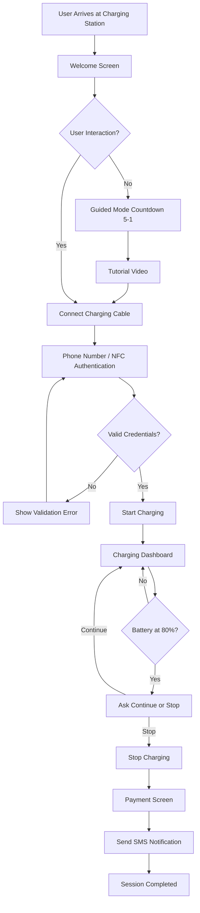

# Cognitive EV Charging HMI System

[](https://opensource.org/licenses/MIT)
[](https://reactjs.org/)
[](https://nodejs.org/)
[](https://vitejs.dev/)

A professional-grade, Cognitive Human-Machine Interface (HMI) for next-generation EV charging infrastructure. This system leverages adaptive behavioral detection and multimodal interaction to provide a seamless charging experience for all demographics.

---

## 1. Project Overview

The **Cognitive EV Charging HMI System** has been enhanced with multiple accessibility, automation, and smart interaction features to improve usability for both experienced and first-time EV users. By analyzing user interaction speed and patterns, the system dynamically reconfigures its UI/UX to match the user's cognitive profile.

---

## 2. Key Features (Latest Version)

### 2.1. Voice Assisted Charging Control
The system supports **hands-free voice interaction** using browser speech recognition.
- **Commands**: "Start charging", "Stop charging", "Continue charging", "Yes, stop", "Help".
- **Voice Feedback**: "Charging started", "Charging stopped", "Cable connected successfully", "Authentication successful".

### 2.2. Guided Mode for First-Time Users
Automatically activates when no user interaction is detected.
- **Countdown**: Announces "Guided mode will start in 5...4...3...2...1".
- **Tutorial**: Plays a tutorial video covering connection, auth, charging, and payment.

### 2.3. Real-Time Charging Dashboard
A premium EV dashboard style showing:
- Battery charge percentage & progress animation.
- Energy delivered (kWh) & Cost ($).
- Charging speed (kW) & **Time remaining**.

### 2.4. Smart Charging Control
Intelligent management features:
- **Automatic 80% Limit**: Reaches 80% and asks user to "Continue Charging" or "Stop Charging".
- **Safety Features**: Child lock and over-voltage protection monitoring.

### 2.5. SMS Notification System
- Enter mobile number for updates on session start, completion, and final costs.
- Optimized panel layout to avoid information overlap.

### 2.6. Audio and Haptic Feedback
- **Sound Cues**: Reliable beeps for connection, success, start, stop, and errors.
- **Haptics**: Tactile feedback for critical interactions and progress.

### 2.7. Error Handling Interface
- Dedicated UI for "Cable not connected", "Auth failure", "Timeout", and "Interruption".
- Clear troubleshooting steps and retry options.

### 2.8. Help & Assistance Dashboard
- Quick access troubleshooting guide, safety instructions, and voice command help.

---

## 3. Technology Stack

| Layer | Technology | Purpose |
|-------|------------|---------|
| **Core** | React 19 / Vite | UI Architecture and lightning-fast dev/build |
| **Interaction** | Web Speech API | Voice recognition (STT) and synthesis (TTS) |
| **Animation** | Framer Motion | High-performance UI state transitions |
| **Styling** | Tailwind CSS / Lucide | Modern utility-first CSS and professional icons |
| **State** | React Hooks / Custom Context | Behavioral tracking and user flow management |

---

## 4. Project Architecture

```text
src
 ├── components         # UI Modules (Authentication, Mic Button, SMS Dashboard)
 ├── context            # UserFlowContext for global state
 ├── hooks              # useCognitive behavioral engine
 ├── pages              # Core screens (Tutorial, NFC Auth, Charging Dashboard)
 ├── utils.js           # Shared Helpers (Haptics, Voice, Audio Beeps)
 └── App.jsx            # Main Router and Central Command Handler
```

---

## 5. System Workflow & Flowchart

The charging session follows an intelligent, bifurcated path based on user proficiency.



---

## 6. Cognitive Logic Model (Proprietary)

The system calculates a **Proficiency Factor ($P$)**:
$$P = f(\Delta T, E_{count}, S_{usage})$$
Where Inter-interaction latency ($\Delta T$) and Error frequency ($E_{count}$) trigger real-time shifts into **Elderly or Guided mode** to minimize **Cognitive Load ($L$)**.

---

## 7. Installation & Deployment

### Setup
```bash
git clone https://github.com/Yallappagouda/HMI_EV_CHARGING
cd HMI_EV_CHARGING
npm install
npm run dev
```

### Deployment
- **Live Prototype**: [ev-charging-rouge.vercel.app](https://ev-charging-rouge.vercel.app/)

---

## 8. License & Versioning

Distributed under the MIT License.
**Version**: 1.3.0  | **Last Updated**: 2026-03-05
